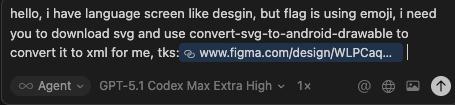
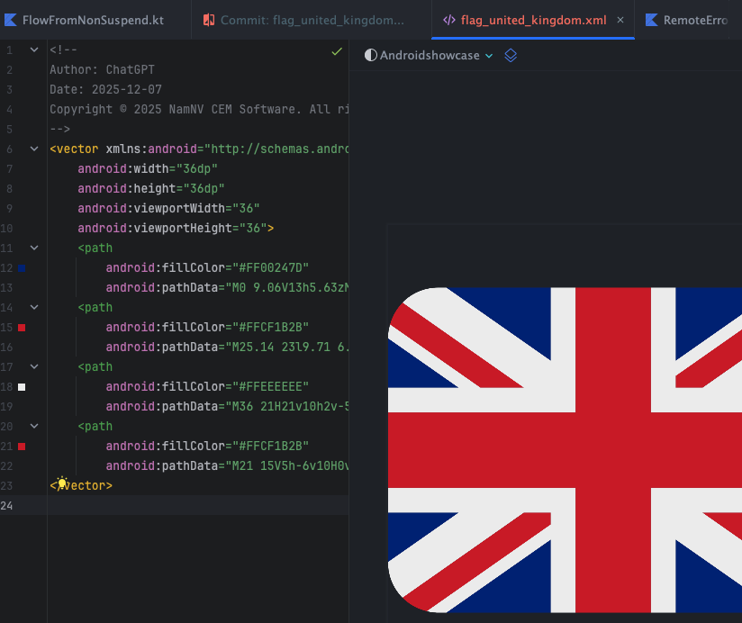
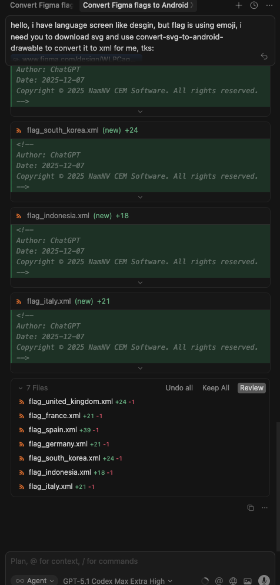
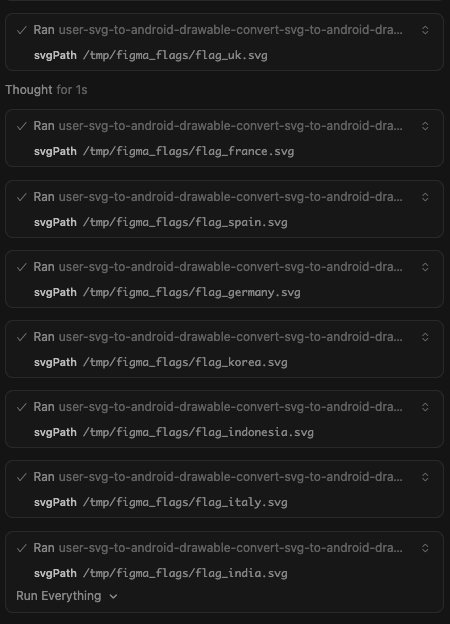

# Android MCP Toolkit for AI Agents

Small MCP server with three tools:
- Fast SVG → Android VectorDrawable conversion (cached, file or inline).
- adb logcat reader with package/pid/tag filters for quick crash triage.
- Translation length difference estimator to flag risky length deltas before layout breaks.

## Why this exists
**The Mission: Bringing Native Android to the AI Agent Era**

While the AI ecosystem flourishes with web-first tools, Android development often feels left behind. This MCP server is my answer to that gap—a dedicated bridge connecting AI Agents directly to the Android toolchain.

⚡ Zero-Friction Asset Conversion: Convert SVGs to VectorDrawables instantly without the overhead of launching Android Studio.

🔍 Direct Diagnostic Access: Empower agents to pull, filter, and analyze adb logcat streams (by package, PID, or tag) in real-time.

🤖 Agent-Native Architecture: Deliver structured, scriptable outputs that LLMs can parse and act upon efficiently.

🚀 Built for Extensibility: A solid foundation designed to grow, paving the way for future utilities like bitmap helpers and asset validation.

## Pairing ideas
- **Figma MCP**: grab SVGs from designs, feed to `convert-svg-to-android-drawable` to get XML for Android resources.
- **Debugging**: while running the app, call `read-adb-logcat` with package name or tag to capture crashes and filtered logs without leaving the MCP client.

### Previews
**SVG to VectorDrawable**
- Figma request → SVG extraction  
  
- Flag conversion preview (single)  
  
- Batch flag review (side-by-side)  
  
- Batch run via MCP (console)  
  

**ADB logcat tool**
- Crash capture prompt (inputs + filters)  
  
- Response preview (summarized logcat)  
  

## Current tools
- `convert-svg-to-android-drawable`
  - Inputs: `svg` (inline) **or** `svgPath` (file path). Optional: `outputPath`, `floatPrecision` (default 2), `fillBlack` (default false), `xmlTag` (default false), `tint`, `cache` (default true).
  - Output: VectorDrawable XML text; also writes to disk when `outputPath` is provided.
  - Performance: LRU cache (32 entries) keyed by SVG + options plus fast reuse in-session.
  - Converter: vendored fork in `vendor/svg2vectordrawable` with fixes for `rgb()/rgba()`, `hsl()/hsla()`, and named colors. Upstream license: `vendor/svg2vectordrawable/LICENSE` (MIT).

- `manage-logcat`
  - Inputs:
    - `action`: `read` (default), `crash`, `anr`, or `clear`.
    - `packageName`: Optional. Resolves PID via `adb shell pidof`.
    - `pid`: Optional. Explicit PID.
    - `tag`: Optional. Filter by tag (e.g. `MyApp`).
    - `priority`: `V`, `D`, `I`, `W`, `E`, `F`, `S` (default `V`).
    - `maxLines`: Tail count (default 200, max 2000).
    - `timeoutMs`: Default 5000.
  - Behavior:
    - `read`: Fetches logcat tail.
    - `crash`: Fetches `logcat -b crash`.
    - `anr`: Fetches recent ActivityManager ANR logs + tail of `/data/anr/traces.txt`.
    - `clear`: clears logcat buffers.

- `get-current-activity`
  - Inputs: `timeoutMs` (default `5000`, max `15000`).
  - Behavior: Inspects `dumpsys window` to find the currently focused app/window. Useful to verify state.

- `dump-ui-hierarchy`
  - Inputs: `timeoutMs` (default 10000).
  - Behavior: Captures current UI hierarchy as XML via `uiautomator`.

- `take-screenshot`
  - Inputs: `outputPath` (required), `timeoutMs`.
  - Behavior: Saves device screenshot to local file.

- `inject-input`
  - Inputs: `command` (`tap`, `text`, `swipe`, `keyevent`, `back`, `home`), `args` (array), `timeoutMs`.
  - Optional: `elementId` or `elementText` (finds element center and taps it).
  - Behavior: Simulates user interaction suitable for testing flows.

- `estimate-text-length-difference`
  - Inputs: `sourceText` (original), `translatedText` (to compare), `tolerancePercent` (default `30`, max `500`).
  - Behavior: Measures grapheme length of both strings, computes percent change, and reports whether it exceeds the tolerance (useful to catch translation length blowups that could break layouts).

## Roadmap (planned)
- Additional MCP tools for Android assets (e.g., batch conversions, validations, optimizers).
- Optional resource prompts for common Android drawables/templates.

## Quick start
- `npm install`
- `npm run build`
- `node dist/index.js` (stdio MCP server)

## Run via npx
- Global: `npx android-mcp-toolkit`

## Use in Cursor (MCP config)
Add to your Cursor settings JSON:
```json
{
  "mcpServers": {
    "android-mcp-toolkit": {
      "command": "npx",
      "args": [
        "-y",
        "android-mcp-toolkit"
      ]
    }
  }
}
```
The npx call downloads the published package; no local path required.

Quick install via Cursor deep link:
- `cursor://anysphere.cursor-deeplink/mcp/install?name=android-mcp-toolkit&config=eyJjb21tYW5kIjoibnB4IC15IGFuZHJvaWQtbWNwLXRvb2xraXQifQ%3D%3D`

## Examples
- Input SVG: `sample_svg.svg`
- Output VectorDrawable: `examples/sample_svg.xml`

## Notes
- Transport: stdio via `@modelcontextprotocol/sdk`.
- Base deps kept minimal; everything needed to convert SVGs is vendored/included.

## Contact
- nam.nv205106@gmail.com
